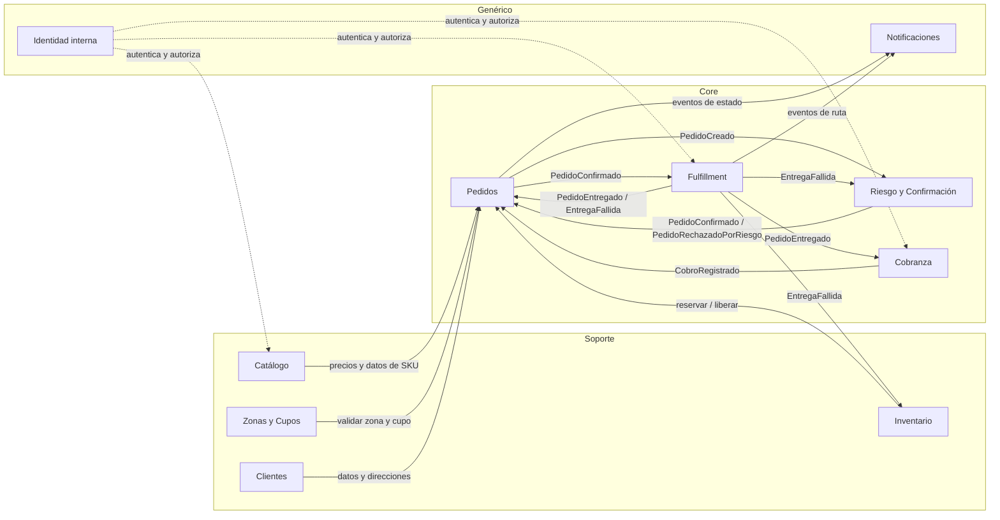
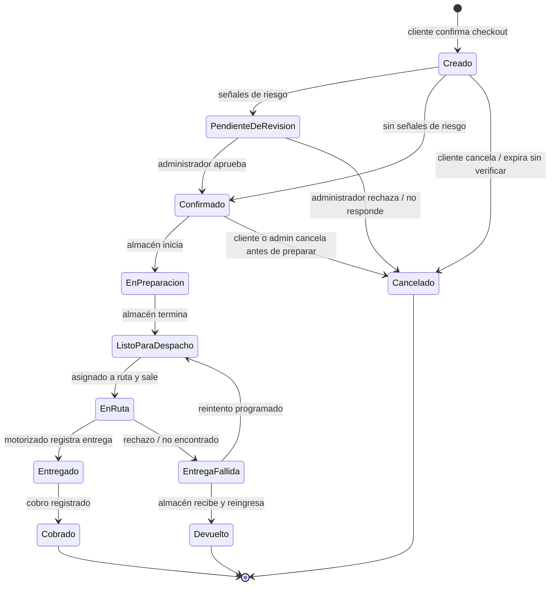

# 02 · Modelo de dominio y bounded contexts

| Campo | Valor |
|---|---|
| Proyecto | D'Too Limpieza |
| Estado | **v1.0 — CERRADO. Aprobado por el dueño del producto el 2026-09-14** |
| Repositorio | GitHub (decisión fijada; se documenta en ADR-004) |
| Fecha | 2026-09-11 |
| Dueño | Cristhian Rodriguez Ruiz |
| Depende de | 01 · Visión y requisitos de calidad (v1.0) |
| Alimenta | 03 · ADRs fundacionales · 04 · Arquitectura y modelo de datos |

> Este documento describe **qué** hace el sistema y cómo se divide, en lenguaje de negocio. No decide tablas, frameworks ni pantallas: eso viene en los pasos 3 y 4. Los diagramas están en Mermaid y se renderizan en GitHub/GitLab.

---

## 1. Propósito

Dividir D'Too Limpieza en módulos (bounded contexts) con fronteras claras, de modo que:
- cada módulo tenga un dueño de datos y un vocabulario propio;
- los módulos se comuniquen por contratos explícitos (llamadas o eventos), nunca leyendo las tablas del otro;
- cualquier módulo pueda crecer o extraerse sin reescribir el resto (requisito 6.7 del documento 01).

## 2. Lenguaje ubicuo

Términos que el equipo, el código y las pantallas usan **exactamente igual**. Si una palabra no está aquí, no va en el código.

| Término | Significado | Contexto dueño |
|---|---|---|
| Producto | Artículo vendible con nombre, descripción, marca y categoría. Ej.: "Detergente líquido Marca X". | Catálogo |
| Presentación | Variante concreta y comprable de un producto: tamaño, formato o pack. Ej.: "1 L", "Galón 4 L", "Pack ×6". Cada presentación tiene su propio SKU, precio y stock. | Catálogo |
| SKU | Código único de una presentación. | Catálogo |
| Categoría | Agrupación jerárquica de productos (Lavandería › Detergentes). | Catálogo |
| Lista de precios | Conjunto de precios por SKU aplicable a un segmento (Hogar, Negocio). | Catálogo |
| Stock disponible | Unidades que se pueden vender ahora = existencia − reservado. | Inventario |
| Reserva | Unidades apartadas para un pedido que aún no se despachó. Expira o se libera si el pedido se cancela. | Inventario |
| Cliente | Persona o negocio que compra. Puede ser invitado (sin cuenta) o registrado. | Clientes |
| Dirección de entrega | Lugar de entrega con coordenadas, referencia y zona asignada. | Clientes |
| Zona de cobertura | Área geográfica servible. Fase 1: Carmen de la Legua-Reynoso. | Zonas y Cupos |
| Franja de entrega | Intervalo horario ofrecido al cliente (ej. 9:00–12:00). | Zonas y Cupos |
| Cupo | Número máximo de pedidos que se aceptan para una zona y franja. | Zonas y Cupos |
| Carrito | Selección de presentaciones y cantidades antes de confirmar la compra. | Pedidos |
| Pedido | Compromiso de compra del cliente con dirección, franja y total a pagar en puerta. | Pedidos |
| Confirmación | Validación de que el pedido es real y entregable, previa a la preparación. | Riesgo y Confirmación |
| Señal de riesgo | Indicio de posible rechazo o fraude (cliente nuevo con monto alto, dirección con rechazos, etc.). | Riesgo y Confirmación |
| Fulfillment | Término estándar del e-commerce para todo el proceso desde que un pedido se confirma hasta que se entrega: preparar, empacar, despachar y entregar. Es el módulo que usan almacén y motorizados. | Fulfillment |
| Preparación | Recolección y empaque de los productos de un pedido en almacén. | Fulfillment |
| Ruta | Salida de un motorizado con un conjunto de pedidos. | Fulfillment |
| Entrega | Momento en que el cliente recibe el pedido. Resultado: entregado o rechazado. | Fulfillment |
| Rechazo | Entrega fallida: el cliente no acepta, no está o la dirección no existe. Lleva motivo. | Fulfillment |
| Cobro | Registro del dinero recibido en una entrega: monto, método y quién lo recibió. | Cobranza |
| Método de cobro | Efectivo, Yape, Plin o POS. | Cobranza |
| Cierre de caja | Conciliación diaria de los cobros de un motorizado contra lo que debía recaudar. | Cobranza |
| Diferencia de caja | Monto declarado − monto esperado, con justificación obligatoria. | Cobranza |
| Usuario interno | Persona del equipo con rol: administrador, almacén, motorizado. | Identidad interna |

## 3. Mapa de contextos

### 3.1 Clasificación

| Tipo | Contextos | Por qué |
|---|---|---|
| **Core** (donde se gana o pierde el negocio) | Pedidos · Fulfillment · Cobranza · Riesgo y Confirmación | Son la operación contraentrega. Aquí va la mayor inversión en diseño y pruebas. |
| **Soporte** (necesarios, específicos del negocio) | Catálogo · Inventario · Zonas y Cupos · Clientes | Reglas propias de D'Too pero sin diferenciación competitiva. |
| **Genérico** (resolubles con librerías o servicios) | Identidad interna · Notificaciones | No se construyen desde cero: se usan componentes de Laravel o paquetes probados. |

### 3.2 Diagrama

Flechas sólidas = comunicación entre módulos (llamada síncrona o evento). Punteadas = servicio transversal.

### 3.3 Reglas de relación

1. **Pedidos es el orquestador del ciclo de vida**, pero no ejecuta la operación: pide a Inventario que reserve, a Zonas que valide, y escucha lo que Fulfillment y Cobranza reportan.
2. **Fulfillment y Cobranza nunca modifican el pedido directamente**: emiten eventos (`PedidoEntregado`, `CobroRegistrado`) y Pedidos actualiza su estado.
3. **Ningún módulo lee tablas de otro.** Si Fulfillment necesita la dirección, la recibe en el evento `PedidoConfirmado` o la pide por la API interna de Pedidos.
4. **Datos duplicados a propósito:** el pedido guarda una copia del precio, nombre de presentación y dirección al momento de crearse. Si el catálogo cambia después, el pedido no cambia.
5. **Los eventos son hechos pasados**, nombrados en pasado (`PedidoConfirmado`), inmutables y con versión.

## 4. Contextos en detalle

Para cada contexto: responsabilidad, agregados (grupos de datos que cambian juntos y protegen una regla), invariantes (reglas que nunca se rompen), y contratos que expone.

### 4.1 Catálogo

**Responsabilidad:** qué se vende, cómo se describe y a qué precio.

**Agregados**
- `Producto` — contiene sus `Presentaciones`. Una presentación no existe sin producto.
- `Categoría` — árbol de hasta 3 niveles.
- `ListaDePrecios` — precios por SKU y segmento, con vigencia.

**Invariantes**
- Un SKU es único en todo el catálogo.
- Toda presentación publicada tiene al menos un precio vigente en la lista Hogar.
- Un producto sin presentaciones publicadas no aparece en la tienda.

**Expone**
- Consulta: presentaciones publicadas, precio vigente por SKU y segmento, árbol de categorías.
- Eventos: `PresentacionPublicada`, `PresentacionRetirada`, `PrecioActualizado`.

**Fuera de su responsabilidad:** stock (Inventario), cuánto se vendió (Pedidos).

### 4.2 Inventario

**Responsabilidad:** cuántas unidades hay, cuántas están comprometidas y cuántas se pueden vender.

**Agregados**
- `ExistenciaSKU` — por SKU: existencia física, reservado, disponible (calculado). Un almacén en fase 1; el modelo lleva `almacén_id` desde ya.
- `Reserva` — unidades apartadas para un pedido, con vencimiento.
- `MovimientoDeInventario` — entrada, salida, ajuste, devolución. Inmutable; el saldo se deriva de los movimientos.

**Invariantes**
- `disponible = existencia − reservado` y nunca es negativo.
- Dos pedidos no pueden reservar la misma última unidad (verificado con prueba de concurrencia).
- Una reserva se libera automáticamente si el pedido no se confirma en el plazo configurado (fase 1: **30 min** para clientes nuevos sin correo verificado). Confirmado.
- Una devolución por rechazo reingresa stock solo cuando almacén lo confirma físicamente.

**Expone**
- Comandos: `reservar(pedido, [sku, cantidad])`, `liberar(pedido)`, `consumir(pedido)` (al despachar), `reingresar(pedido, [sku, cantidad], motivo)`.
- Consulta: disponible por SKU.
- Eventos: `StockReservado`, `ReservaLiberada`, `StockAgotado`, `StockReingresado`.

### 4.3 Zonas y Cupos

**Responsabilidad:** dónde se entrega, en qué franjas y cuántos pedidos se aceptan.

**Agregados**
- `ZonaDeCobertura` — polígono geográfico, nombre, activa/inactiva. Fase 1: una zona.
- `FranjaDeEntrega` — intervalo horario dentro de 7:00–21:00, con día de semana.
- `Cupo` — por zona, fecha y franja: máximo y ocupados. Configurable a diario según motorizados activos.

**Invariantes**
- Un pedido solo se acepta si sus coordenadas caen dentro de una zona activa.
- `ocupados ≤ máximo` en todo momento; tomar cupo es atómico igual que reservar stock.
- El cupo se devuelve si el pedido se cancela antes de despacharse.

**Expone**
- Consulta: `zonaPara(coordenadas)`, `franjasDisponibles(zona, fecha)`.
- Comandos: `tomarCupo(pedido, zona, fecha, franja)`, `devolverCupo(pedido)`.
- Eventos: `CupoAgotado`, `CupoActualizado`.

### 4.4 Clientes

**Responsabilidad:** quién compra y dónde recibe.

**Agregados**
- `Cliente` — identificador, nombre, **teléfono (identificador principal)**, correo opcional, segmento (Hogar/Negocio), estado de verificación de correo, tipo (invitado/registrado). Los invitados se crean con cada pedido y se reconocen por teléfono si vuelven.
- `DireccionDeEntrega` — texto, referencia obligatoria, coordenadas, zona asignada, etiqueta ("Casa", "Bodega").

**Invariantes**
- El teléfono es obligatorio y único por cliente; el correo es opcional; DNI/RUC no se piden en fase 1.
- Una dirección siempre tiene coordenadas y zona; sin zona no se guarda.
- Los datos personales de invitados se anonimizan a los 12 meses de la última entrega; los de registrados a los 24 meses de inactividad (documento 01, §6.5).

**Expone**
- Comandos: `crearOReconocerInvitado`, `registrar`, `verificarCorreo`, `agregarDireccion`.
- Consulta: cliente y direcciones, historial resumido (n.º pedidos, rechazos) para Riesgo.
- Eventos: `ClienteRegistrado`, `CorreoVerificado`, `DireccionAgregada`.

### 4.5 Pedidos (core)

**Responsabilidad:** el compromiso de compra y su ciclo de vida completo.

**Agregados**
- `Carrito` — líneas (SKU, cantidad), segmento, total estimado. Efímero; puede vivir en sesión.
- `Pedido` — raíz principal del sistema. Contiene: `LíneasDePedido` (copia de SKU, nombre, precio unitario, cantidad, IGV), dirección copiada, franja, total a cobrar, método de cobro preferido, estado, historial de transiciones.

**Máquina de estados del pedido**

**Invariantes**
- Un pedido solo se crea si Inventario reservó **todas** las líneas y Zonas tomó cupo. Si algo falla, no hay pedido (todo o nada).
- El total a cobrar se calcula en el servidor y se congela al crear el pedido.
- Toda transición de estado queda registrada con fecha, usuario/sistema y motivo. No se editan estados pasados.
- Solo las transiciones del diagrama son válidas; cualquier otra es un error.
- `Cancelado` libera stock y cupo. `Devuelto` reingresa stock (vía Inventario) y cierra el pedido.
- Un pedido en `EntregaFallida` puede reintentarse **una vez**; al segundo fallo pasa a `Devuelto`. Confirmado.

**Expone**
- Comandos: `crearPedido`, `cancelar`, `marcarEnPreparacion`, `marcarListo`, `marcarEnRuta`, `registrarResultadoDeEntrega`, `programarReintento`.
- Consulta: pedido por id, pedidos por estado, pedidos de un cliente, pedidos por fecha y franja (para Fulfillment).
- Eventos: uno por transición (`PedidoCreado`, `PedidoConfirmado`, `PedidoEnRuta`, `PedidoEntregado`, `EntregaFallida`, `PedidoCancelado`, `PedidoDevuelto`, `PedidoCobrado`).

### 4.6 Riesgo y Confirmación (core)

**Responsabilidad:** decidir si un pedido se confirma solo o necesita revisión humana, sin servicios de pago.

**Agregados**
- `EvaluacionDeRiesgo` — por pedido: señales detectadas, puntaje, decisión (auto-confirmar / revisar), quién resolvió y cuándo.
- `ReglaDeRiesgo` — configurable por el administrador: condición, peso, activa.
- `ListaDeObservacion` — teléfonos, correos y direcciones con rechazos o incidentes previos.

**Reglas iniciales (configurables, no código)**

| Señal | Peso inicial |
|---|---|
| Cliente sin pedidos previos | +2 |
| Sin correo, o correo no verificado | +2 |
| Monto > S/ 150 en primer pedido (valor inicial, configurable) | +3 |
| Dirección o teléfono en lista de observación | +5 |
| Más de 2 pedidos a la misma dirección en 24 h | +3 |
| Cliente con ≥ 3 entregas exitosas | −4 |

Decisión: puntaje ≤ 3 → auto-confirmar; > 3 → revisión por llamada. Umbral configurable; meta del documento 01: ≥ 80 % auto-confirmados.

**Control manual del administrador:** cualquier pedido, tenga o no señales de riesgo, puede confirmarse o rechazarse con un botón. Un ajuste global `confirmacion_manual_para_todos` desactiva la auto-confirmación y envía todos los pedidos a revisión; se recomienda activo en las primeras semanas.

**Invariantes**
- Toda decisión queda registrada con las señales que la motivaron (auditable).
- Un rechazo en puerta alimenta automáticamente la lista de observación.
- La revisión humana tiene un plazo; vencido, el pedido se cancela y libera stock y cupo (fase 1: **2 h** dentro del horario de operación). Confirmado.

**Expone**
- Reacciona a `PedidoCreado` → emite `PedidoConfirmado` o `PedidoEnRevision`.
- Comandos del administrador: `aprobar(pedido, nota)`, `rechazar(pedido, motivo)`, `activarConfirmacionManualGlobal(bool)`.
- Reacciona a `EntregaFallida` → actualiza lista de observación.

### 4.7 Fulfillment (core)

**Responsabilidad:** preparar, despachar y entregar. Es el módulo que usan almacén y motorizados.

**Agregados**
- `OrdenDePreparacion` — por pedido: líneas a recolectar, quién prepara, inicio/fin, incidencias (faltante).
- `Ruta` — motorizado, fecha, salida n.º, lista ordenada de `Paradas`, estado (planificada / en curso / cerrada).
- `Parada` — pedido, orden en la ruta, resultado (`Entregado` / `Rechazado` con motivo / `NoEncontrado`), hora, coordenadas donde se registró, notas.

**Invariantes**
- Un pedido está en una sola ruta activa a la vez.
- Una ruta no puede salir sin motorizado asignado.
- La capacidad física configurada (fase 1: ~30 pedidos por moto) es **orientativa**: al superarla el panel muestra un aviso, pero **no bloquea** ninguna operación.
- Un resultado de parada se registra una sola vez; corregirlo requiere rol administrador y queda auditado.
- Un faltante en preparación notifica al administrador y bloquea el pedido hasta resolverse (ajuste de inventario o contacto con el cliente).

**Expone**
- Comandos: `iniciarPreparacion`, `terminarPreparacion`, `reportarFaltante`, `crearRuta`, `agregarParada`, `iniciarRuta`, `registrarResultado`, `cerrarRuta`.
- Consulta: cola de preparación, rutas del día, paradas de un motorizado (para la app).
- Eventos: `PreparacionTerminada`, `RutaIniciada`, `PedidoEntregado`, `EntregaFallida`, `RutaCerrada`.

### 4.8 Cobranza (core)

**Responsabilidad:** registrar el dinero recibido en puerta y cuadrar la caja de cada motorizado cada día.

**Agregados**
- `Cobro` — por entrega: pedido, motorizado, monto esperado, monto recibido, método (Efectivo / Yape / Plin / POS), referencia (n.º de operación si aplica), hora. **Inmutable.**
- `AjusteDeCobro` — corrección con motivo y autorización; nunca se edita el cobro original.
- `CierreDeCaja` — por motorizado y día: suma esperada, suma declarada por método, diferencia, justificación, estado (abierto / cerrado), quién cerró.

**Invariantes**
- Cada pedido `Entregado` tiene exactamente un cobro (o uno más ajustes).
- El cierre no puede completarse si `diferencia ≠ 0` sin justificación escrita y aprobación del administrador.
- Un cierre de caja abierto de un día anterior **no bloquea** al motorizado ni a ninguna funcionalidad: genera un aviso permanente al administrador y aparece en la lista de cierres pendientes hasta resolverse.
- Los montos se guardan en decimal exacto en soles (PEN).

**Expone**
- Reacciona a `PedidoEntregado` → crea el `Cobro` con lo registrado por el motorizado.
- Comandos: `registrarAjuste`, `abrirCierre`, `declararMontos`, `cerrarCaja`.
- Consulta: cobros del día por motorizado, cierres pendientes, diferencias históricas.
- Eventos: `CobroRegistrado`, `CajaCerrada`, `DiferenciaDeCajaDetectada`.

### 4.9 Identidad interna (genérico)

**Responsabilidad:** quién es cada usuario del equipo y qué puede hacer.

- Roles fase 1: **Administrador** (todo), **Almacén** (preparación, faltantes, recepción de devoluciones), **Motorizado** (solo sus rutas y cobros).
- MFA obligatorio para Administrador (documento 01, §6.4).
- Se resuelve con las capacidades nativas de Laravel (autenticación, políticas, guards), no con código propio.
- Separado de la autenticación de **clientes** de la tienda, que vive en Clientes; son dos poblaciones con reglas distintas.

### 4.10 Notificaciones (genérico)

**Responsabilidad:** avisar al cliente y al equipo, sin costos por mensaje.

- Canales fase 1: correo electrónico (cliente, cuando lo proporcionó), consulta pública del pedido por número + teléfono, **hoja de pedido imprimible** desde el panel, notificaciones dentro del panel y la app (equipo), y **actualización en tiempo real de disponibilidad de stock** en la tienda (reacciona a `StockAgotado`, `StockReingresado`, `StockReservado`).
- Reacciona a eventos: `PedidoCreado` (correo con enlace de verificación si aplica), `PedidoConfirmado`, `PedidoEnRuta`, `PedidoEntregado`, `EntregaFallida`, `PedidoEnRevision` (aviso al administrador), `DiferenciaDeCajaDetectada`.
- No contiene lógica de negocio; solo plantillas y envío. Las plantillas son datos editables.

## 5. Recorridos principales (cómo colaboran los módulos)

### 5.1 Compra exitosa de un cliente conocido
1. Cliente arma el carrito (Catálogo da precios según segmento; la tienda muestra disponibilidad en tiempo real).
2. En checkout, Clientes reconoce al cliente por teléfono; Zonas valida la dirección y ofrece franjas con cupo.
3. Cliente confirma → Pedidos pide a Inventario reservar y a Zonas tomar cupo, en una sola operación todo-o-nada → `PedidoCreado`.
4. Riesgo evalúa: cliente con 3 entregas previas → puntaje bajo → `PedidoConfirmado`. Notificaciones envía correo.
5. Almacén ve el pedido en su cola, prepara → `PreparacionTerminada`; Inventario consume la reserva.
6. Administrador arma la ruta de la franja, asigna motorizado → `RutaIniciada` → `PedidoEnRuta`; correo al cliente.
7. Motorizado entrega, registra cobro en efectivo → `PedidoEntregado` + `CobroRegistrado` → Pedidos pasa a `Cobrado`.
8. Fin del día: motorizado declara montos, administrador cierra caja con diferencia cero.

### 5.2 Cliente nuevo con pedido grande
1–3. Igual que arriba; Clientes crea un invitado.
4. Riesgo: sin historial (+2), sin correo (+2), monto alto (+3) = 7 → `PedidoEnRevision`. Notificaciones avisa al administrador.
5. Administrador llama al teléfono, confirma con el botón → `PedidoConfirmado`. Continúa como 5.1. El almacén imprime la hoja de pedido que viaja con el paquete.
   - Si no responde en 2 h → `PedidoCancelado`, stock y cupo liberados, correo al cliente.

### 5.3 Rechazo en puerta
1–6. Igual que 5.1.
7. Cliente no está. Motorizado registra `NoEncontrado` con nota → `EntregaFallida` → Pedidos pasa a `EntregaFallida`; Riesgo anota la dirección; Notificaciones avisa al cliente.
8. Administrador decide: reintento en la siguiente franja (vuelve a `ListoParaDespacho`) o devolución.
9. Si devolución: almacén recibe físicamente, confirma → Inventario `reingresar` → Pedidos `Devuelto`.

### 5.4 Diferencia de caja
1. Cierre del día: esperado S/ 1 240, declarado S/ 1 200.
2. `DiferenciaDeCajaDetectada` (−40). Cierre bloqueado.
3. Motorizado justifica ("vuelto mal dado en pedido #4521"). Administrador revisa, aprueba, registra `AjusteDeCobro` en el pedido, cierra caja. Todo queda auditado.

## 6. Catálogo de eventos de dominio

| Evento | Emisor | Consumidores | Datos mínimos |
|---|---|---|---|
| PedidoCreado | Pedidos | Riesgo, Notificaciones | pedido_id, cliente_id, total, líneas, dirección, franja |
| PedidoEnRevision | Riesgo | Pedidos, Notificaciones | pedido_id, señales, puntaje |
| PedidoConfirmado | Riesgo/Pedidos | Fulfillment, Notificaciones | pedido_id, modo (auto/manual) |
| PedidoCancelado | Pedidos | Inventario, Zonas, Notificaciones | pedido_id, motivo |
| PreparacionTerminada | Fulfillment | Pedidos, Inventario | pedido_id, preparado_por |
| RutaIniciada | Fulfillment | Pedidos, Notificaciones | ruta_id, motorizado_id, pedidos[] |
| PedidoEntregado | Fulfillment | Pedidos, Cobranza, Notificaciones | pedido_id, hora, método, monto_recibido, coordenadas |
| EntregaFallida | Fulfillment | Pedidos, Riesgo, Notificaciones | pedido_id, motivo, hora |
| PedidoDevuelto | Pedidos | Inventario | pedido_id, líneas |
| CobroRegistrado | Cobranza | Pedidos | cobro_id, pedido_id, monto, método |
| DiferenciaDeCajaDetectada | Cobranza | Notificaciones | cierre_id, motorizado_id, diferencia |
| StockAgotado | Inventario | Catálogo (ocultar), Notificaciones (admin) | sku |
| CupoAgotado | Zonas | Notificaciones (admin) | zona, fecha, franja |

Todos los eventos llevan: `event_id` único, `ocurrido_en`, `version`. Se publican mediante outbox transaccional (decisión en paso 3).

## 7. Preparado para las fases futuras (sin construirlas)

| Fase | Qué cambia | Por qué el modelo ya lo soporta |
|---|---|---|
| 2 · Más distritos y couriers externos | Varias zonas, tarifas, un "transportista" que no es motorizado propio | Zona es un agregado con polígono y tarifa; Ruta tiene `motorizado_id` que puede generalizarse a `transportista_id`; Cobranza ya concilia por responsable |
| 3 · Cuentas empresa | Precios por cliente, crédito, pedidos programados | ListaDePrecios ya existe por segmento; Pedido ya copia precios; solo se añade lista por cliente y un estado `Programado` |
| 4 · Pago en línea | Pago antes de la entrega | Cobro ya es una entidad separada del Pedido; un pago en línea es un `Cobro` con método nuevo y momento distinto |
| Futura · Comprobantes fiscales | Emisión de documentos | El pedido guarda IGV por línea y los datos del cliente; se añade un módulo `Facturación` que reacciona a `PedidoEntregado` |

## 8. Decisiones abiertas para el paso 3 (ADRs)

1. Estructura de módulos en Laravel: paquete `nwidart/laravel-modules` vs. estructura propia por carpetas y namespaces.
2. Comunicación entre módulos: eventos síncronos de Laravel dentro de la misma transacción vs. outbox + colas desde el día 1.
3. Dónde vive el carrito: sesión/Redis vs. base de datos (afecta a invitados y a abandono).
4. Cómo se determina la zona de una coordenada: cálculo propio de punto-en-polígono vs. funciones espaciales de MySQL.
5. Reintentos de entrega: uno (supuesto actual) vs. configurable.
6. Tiempo real hacia la tienda: WebSockets (Laravel Reverb / Pusher) vs. Server-Sent Events.
7. Sincronización fuera de línea de la PWA del motorizado: cola local de operaciones y resolución de conflictos.

## 9. Parámetros confirmados por el dueño

| Parámetro | Valor | Nota |
|---|---|---|
| Expiración de reserva (cliente nuevo sin correo verificado) | 30 min | Configurable |
| Plazo de revisión humana | 2 h dentro del horario | Configurable; vencido → cancelación y liberación de stock y cupo |
| Umbral de monto alto en primer pedido | S/ 150 | Valor inicial, configurable |
| Reintentos de entrega | 1 | Al segundo fallo → Devuelto |
| Cierre de caja abierto | No bloquea | Solo aviso al administrador |
| Capacidad por moto (~30 pedidos) | No bloquea | Solo aviso |
| Correo del cliente | Opcional | Teléfono es el identificador |
| Repositorio de código | GitHub | |

## 10. Historial de versiones

| Versión | Fecha | Cambio |
|---|---|---|
| 0.1 | 2026-09-11 | Borrador inicial |
| 0.2 | 2026-09-14 | Teléfono como identificador, confirmación manual, hoja impresa, tiempo real |
| 1.0 | 2026-09-14 | Parámetros confirmados; bloqueos convertidos en avisos; documento cerrado |
