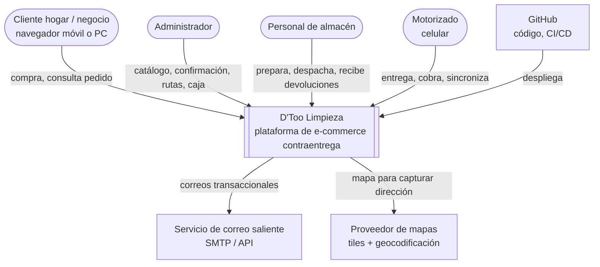
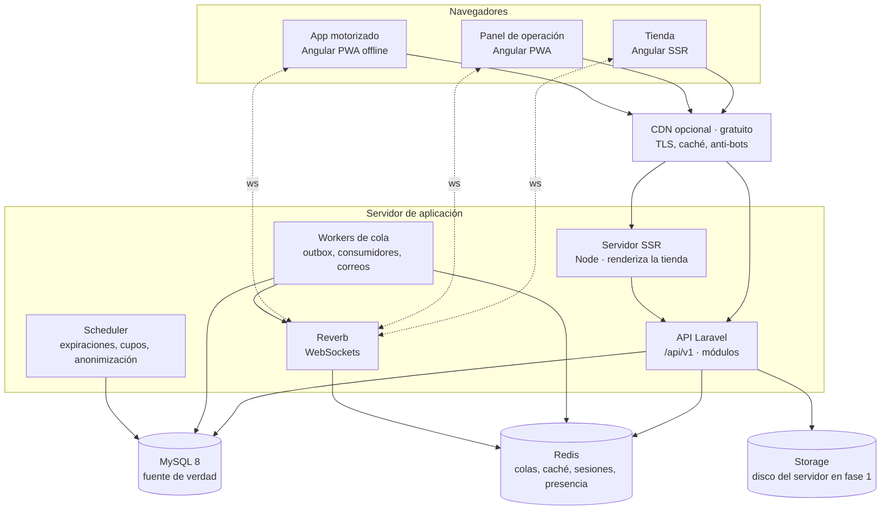
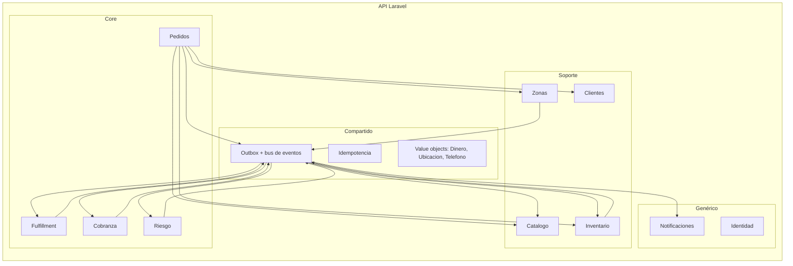
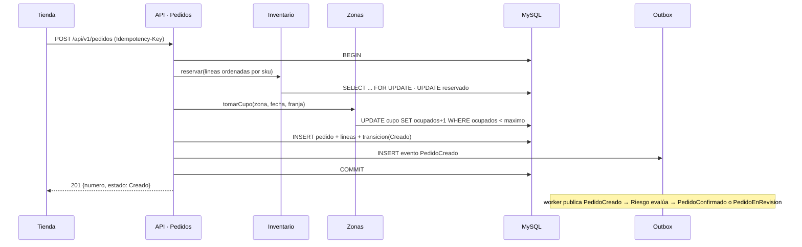
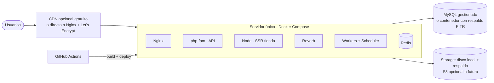

# 03 · Arquitectura del sistema (arc42 + C4)

| Campo | Valor |
|---|---|
| Proyecto | D'Too Limpieza |
| Estado | **v1.0 — CERRADO. Aprobado por el dueño del producto el 2026-09-14** |
| Fecha | 2026-09-14 |
| Depende de | 01 (v1.1 cerrado) · 02 (v1.0 cerrado) · ADR-001 a ADR-008 |
| Alimenta | 04 · Modelo de datos · 05 · Diseño UX · configuración del repositorio |

> Estructura según la plantilla arc42. Los diagramas siguen el modelo C4 (Contexto → Contenedores → Componentes). Este documento no repite lo que ya está en 01, 02 o los ADRs: los referencia.

---

## 1. Introducción y objetivos

**Qué es:** plataforma de venta en línea de productos de limpieza con pago contraentrega, operada con almacén y motorizados propios en Carmen de la Legua-Reynoso.

**Objetivos de calidad que gobiernan la arquitectura** (los tres más importantes, del documento 01 §6):

| Prioridad | Objetivo | Escenario de verificación |
|---|---|---|
| 1 | **Integridad de dinero y stock** | Dos compras simultáneas de la última unidad: una gana, la otra recibe "agotado". Todo cobro es inmutable y auditable. |
| 2 | **Continuidad de la operación** | La web pública cae 30 min: almacén y motorizados siguen trabajando; el motorizado sin señal registra 10 entregas y todas llegan al servidor al reconectar. |
| 3 | **Evolución sin reescritura** | Abrir un segundo distrito o cambiar la herramienta de tiempo real no toca los módulos de negocio. |

**Stakeholders:** dueño/administrador (Cristhian Rodriguez Ruiz), 2 personas de almacén, 3 motorizados, clientes hogar y negocio, 2 desarrolladores.

## 2. Restricciones

Ver documento 01 §7 y ADRs 001–004: Angular, Laravel API, MySQL 8, GitHub monorepo, sin servicios de mensajería de pago, sin pagos en línea, equipo de dos.

## 3. Contexto y alcance (C4 nivel 1)



**Interfaces externas**

| Sistema externo | Uso | Protocolo | Criticidad | Notas |
|---|---|---|---|---|
| Correo saliente | Confirmaciones, avisos a clientes con correo | SMTP o API HTTP del proveedor | Baja (el correo es opcional) | Adaptador en módulo Notificaciones; proveedor intercambiable |
| Mapas | Mostrar mapa y obtener coordenadas al capturar dirección; geocodificación opcional | HTTPS (tiles y API) | Media (sin mapa, el cliente puede escribir dirección y el administrador la geolocaliza) | Se prefiere proveedor con capa gratuita generosa (p. ej. OpenStreetMap + Nominatim/MapLibre); decisión en ADR-009 |
| GitHub | Repositorio, CI/CD | HTTPS | Alta para desarrollo, nula para operación | ADR-004 |

No hay integración con pasarelas de pago, transportistas externos ni entidades fiscales (documento 01 §4.1).

## 4. Estrategia de solución

| Problema | Estrategia | Dónde se detalla |
|---|---|---|
| Diez módulos con fronteras, un equipo de dos | Monolito modular en Laravel; fronteras verificadas en CI | ADR-005 |
| Consistencia de stock, cupo y pedido | Una transacción MySQL para crear pedido; reservas y cupos con bloqueo de fila | 02 §4.5, ADR-003 |
| Reacciones sin perder eventos | Outbox transaccional + colas Redis; consumidores idempotentes | ADR-006 |
| Tiempo real sin costo | Laravel Reverb + Echo | ADR-007 |
| Motorizado sin señal | PWA con cola local de operaciones idempotentes | ADR-008 |
| Tres frontends con un desarrollador | Un workspace Angular, design system compartido, cliente generado desde OpenAPI | ADR-001, ADR-006 |
| SEO y rendimiento de la tienda | Angular SSR, imágenes optimizadas, CDN gratuito opcional | ADR-001, §8.6 |
| Sin servicios de pago para confirmar | Reglas de riesgo por historial + botón manual + correo opcional | 02 §4.6 |

## 5. Vista de bloques

### 5.1 Contenedores (C4 nivel 2)



| Contenedor | Tecnología | Responsabilidad |
|---|---|---|
| Tienda | Angular con SSR | Catálogo, carrito, checkout, consulta de pedido por número + teléfono |
| Panel de operación | Angular PWA | Catálogo e inventario, confirmación de pedidos, cola de preparación, rutas, caja, configuración |
| App motorizado | Angular PWA con IndexedDB | Ruta del día, registro de entregas y cobros, sincronización |
| CDN (**opcional, costo cero**) | Plan gratuito de Cloudflare o equivalente | Capa delante del servidor: TLS, caché de estáticos y páginas de catálogo, protección básica contra bots. Sin CDN, Nginx sirve todo directamente con certificado gratuito de Let's Encrypt; el código no cambia. |
| API Laravel | PHP-FPM tras Nginx | Toda la lógica de negocio; expone `/api/v1` según `contracts/openapi.yaml` |
| Servidor SSR | Node (Angular SSR) | Renderiza la tienda en servidor para SEO y LCP; consume la API |
| Reverb | Laravel Reverb | Canales en tiempo real (ADR-007) |
| Workers | `queue:work` (Horizon) | Publican el outbox, ejecutan consumidores (riesgo, notificaciones, proyecciones), emiten a Reverb |
| Scheduler | `schedule:run` | Expira reservas (30 min), vence revisiones (2 h), recalcula cupos, anonimiza datos (12/24 meses), verifica cierres pendientes |
| Redis | Redis 7 | Colas, caché de catálogo, sesiones de carrito, backend de Reverb |
| MySQL | MySQL 8 LTS | Única fuente de verdad transaccional (ADR-003) |
| Almacén de archivos (storage) | **Fase 1: disco del servidor con respaldo diario.** Opcional después: servicio compatible S3 | Imágenes de catálogo y fotos de entrega; en la base solo la ruta. El adaptador de Laravel (`Storage`) permite cambiar de disco a S3 por configuración |

### 5.2 Componentes del backend (C4 nivel 3)

Un módulo por bounded context del documento 02, con la estructura interna del ADR-005.



**Regla de dependencias:** Core → Soporte (solo vía `Contracts/`); todos → Compartido; nadie → Core salvo por eventos. Verificado con deptrac en CI.

**Compartido (`app/Shared/`)** contiene lo que no pertenece a ningún módulo: value objects (Dinero en `DECIMAL` con moneda, Telefono normalizado a E.164, Ubicacion lat/lng), el bus de eventos con outbox, el middleware de `Idempotency-Key`, el formato de errores RFC 9457, y los comandos artisan `make:module` / `make:use-case`.

### 5.3 Componentes del frontend

```
frontend/
  apps/tienda        rutas: / , /c/:categoria , /p/:slug , /carrito , /checkout , /pedido/:numero
  apps/panel         rutas: /pedidos , /preparacion , /rutas , /caja , /catalogo , /inventario , /clientes , /configuracion
  apps/motorizado    rutas: /ruta , /parada/:id , /sincronizacion
  libs/design-system tokens, componentes accesibles, estados vacíos/carga/error
  libs/api-client    generado desde contracts/openapi.yaml — no se edita a mano
  libs/dominio       EstadoPedido, formateo de dinero y teléfono, validaciones compartidas
  libs/realtime      envoltorio de Echo con reconexión y respaldo por sondeo
  libs/offline-queue cola de operaciones en IndexedDB (solo la usa motorizado)
```

## 6. Vista de ejecución (escenarios)

### 6.1 Crear un pedido (todo-o-nada)



Si `reservar` o `tomarCupo` fallan, la transacción se revierte y la tienda recibe un error específico (`stock_insuficiente` con los SKU afectados, o `cupo_agotado` con las franjas alternativas). Reintentar con la misma `Idempotency-Key` devuelve la misma respuesta.

### 6.2 Evaluación de riesgo y confirmación

1. Worker consume `PedidoCreado`. Riesgo consulta a Clientes el historial resumido por teléfono.
2. Aplica reglas activas (02 §4.6). Si `confirmacion_manual_para_todos` está activo o el puntaje supera el umbral → `PedidoEnRevision`; si no → `PedidoConfirmado`.
3. Pedidos aplica la transición; Notificaciones envía correo (si hay) y emite a `panel.pedidos` vía Reverb.
4. En revisión: el administrador ve el pedido con sus señales, llama, pulsa **Confirmar** o **Rechazar**. El scheduler cancela los que superen 2 h dentro del horario.

### 6.3 Entrega y cobro sin señal (ADR-008)

1. Motorizado marca "Entregado, efectivo, S/ 86,00" → se guarda en IndexedDB con `operation_id`.
2. Al reconectar, la app envía `POST /api/v1/paradas/{id}/resultado` con `Idempotency-Key = operation_id`.
3. Fulfillment valida la transición, registra la parada, inserta `PedidoEntregado` en el outbox, commit.
4. Consumidores: Pedidos → `Entregado`; Cobranza crea el `Cobro` (inmutable) → `CobroRegistrado` → Pedidos → `Cobrado`; Notificaciones emite a panel y correo.
5. Si el servidor rechaza la operación (p. ej. pedido cancelado por el administrador mientras el motorizado estaba sin señal), la app muestra el conflicto y el administrador lo resuelve desde el panel.

### 6.4 Disponibilidad en tiempo real

`StockReservado` / `ReservaLiberada` / `StockReingresado` → consumidor calcula el estado del SKU (disponible / pocas unidades ≤ umbral configurable / agotado) → si cambió, emite a `catalogo.disponibilidad` y actualiza la caché del catálogo. La tienda actualiza el badge del producto; el checkout siempre revalida en el servidor.

### 6.5 Cierre de caja

Fin de jornada: Cobranza calcula esperado por motorizado y método desde los cobros; el motorizado declara lo entregado; diferencia ≠ 0 → `DiferenciaDeCajaDetectada` → aviso en `panel.avisos`; el administrador aprueba con justificación y registra `AjusteDeCobro`. Un cierre abierto nunca bloquea rutas (02 §9).

## 7. Vista de despliegue

### Fase 1 (propuesta; se formaliza en ADR-009)



- **Un servidor** (VPS de 4 vCPU / 8 GB es holgado para 300 pedidos/día) con todos los procesos en Docker Compose, misma composición que en local. Nginx termina TLS con Let's Encrypt; el CDN gratuito es opcional y se activa cambiando los DNS, sin tocar el servidor.
- **Storage:** directorio `storage/` del servidor con respaldo diario junto a la base; migrar a S3 es un cambio de configuración del disco de Laravel.
- **MySQL:** preferentemente gestionado por el proveedor (respaldos y PITR incluidos); si va en el mismo servidor, respaldo diario + binlogs a almacenamiento externo y **restauración de prueba trimestral** (01 §6.1).
- **Entornos:** `local` (Docker Compose), `staging` (réplica del VPS con datos sintéticos), `producción`. Despliegue: imagen construida en CI → staging automático → producción por promoción manual con rollback a la imagen anterior (ADR-004).
- **Migraciones** se ejecutan antes de cambiar de imagen, siempre compatibles hacia atrás (ADR-003).
- **Crecimiento:** separar MySQL y Redis a servicios gestionados → segundo servidor de aplicación detrás del balanceador del proveedor → Reverb y workers en su propio servidor. Ningún paso cambia el código.

## 8. Conceptos transversales

### 8.1 Seguridad (ASVS 5.0 nivel 2)
- Dos poblaciones de usuarios con guards separados: clientes (Sanctum, sesión de tienda) y personal (Sanctum + **MFA obligatorio para administrador**).
- Autorización por policies en cada caso de uso; el motorizado solo accede a sus rutas (comprobado en pruebas de autorización por objeto).
- Rate limiting en login, checkout y consulta de pedido; CAPTCHA propio-alojado solo si se detecta abuso.
- Cabeceras: CSP estricta con nonces, HSTS, sin scripts de terceros en checkout salvo el mapa.
- Secretos en variables de entorno del servidor gestionadas fuera del repositorio; rotación documentada.
- Auditoría: tabla `auditoria` con actor, acción, entidad, antes/después para pedidos, cobros, precios y configuración.

### 8.2 Protección de datos (Ley 29733)
- Datos personales solo en módulo Clientes y copiados al pedido; el resto referencia por identificador.
- Anonimización programada (12 meses invitados, 24 inactividad) por el scheduler: reemplaza nombre, teléfono, correo y dirección por marcadores, conserva agregados estadísticos.
- Consentimiento de marketing en tabla propia con versión del texto, fecha y canal.
- Logs sin datos personales: se registra `cliente_id`, nunca teléfono ni nombre.
- Endpoints `exportar` y `eliminar` por cliente para derechos ARCO.

### 8.3 Manejo de errores
- Formato único RFC 9457: `type`, `title`, `status`, `detail`, `errors[]`, `trace_id`.
- Errores de dominio tipados (`StockInsuficiente`, `CupoAgotado`, `TransicionInvalida`) mapeados a 409/422 con códigos estables que el frontend traduce a mensajes.
- Excepciones inesperadas → 500 sin detalles + alerta.

### 8.4 Idempotencia
Middleware en toda operación de escritura: `Idempotency-Key` + hash del cuerpo → respuesta cacheada 24 h en MySQL (tabla `idempotencia`). Misma clave con cuerpo distinto → 422.

### 8.5 Observabilidad
- Logs JSON estructurados con `trace_id` propagado desde el frontend.
- Métricas técnicas (latencia p95 por ruta, errores, profundidad de colas, retraso del outbox, conexiones Reverb) y **de negocio** (pedidos por estado, tasa de rechazo, cupo usado, diferencias de caja, % auto-confirmados).
- Alertas accionables: outbox con retraso > 30 s, cola atascada, error rate > 1 %, cierre pendiente > 24 h, cupo agotado en franja.
- Herramienta: pila con capa gratuita (p. ej. Grafana Cloud) o autoalojada; decisión en ADR-010.

### 8.6 Rendimiento y caché
- Catálogo: caché en Redis por categoría y SKU, invalidada por eventos. Si se activa el CDN, páginas de categoría cacheadas 60 s con purga por evento.
- Cero caché en carrito, checkout, panel y app.
- Imágenes: redimensionadas al subir en 3 tamaños, WebP/AVIF, servidas por Nginx desde el disco con cabeceras de caché largas (y por el CDN si está activo).
- Presupuesto de la tienda: ≤ 200 KB de JS inicial, LCP ≤ 2,5 s en 4G (01 §6.2), verificado con Lighthouse CI.

### 8.7 Internacionalización y formatos
- Idioma único (es-PE) en fase 1, pero todos los textos de la tienda en archivos de traducción de Angular.
- Dinero: `S/ 1 234,50`; fechas y horas en America/Lima en pantalla, UTC en base.

### 8.8 Pruebas
Pirámide por tipo de módulo (documento de prácticas de desarrollo):
- **Dominio:** unitarias puras (máquina de estados, reglas de riesgo, cálculo de totales, cierre de caja).
- **Aplicación e infraestructura:** integración con MySQL real (reservas concurrentes, outbox, idempotencia).
- **Contrato:** la API contra `openapi.yaml`; el frontend contra un servidor simulado generado del mismo archivo.
- **Frontend:** component tests con Testing Library + axe; E2E con Playwright solo en 6 recorridos: comprar como invitado, comprar como cliente fiel, revisión y confirmación manual, preparación y ruta, entrega sin señal y sincronización, cierre de caja con diferencia.
- **Carga:** checkout a 60 pedidos/hora sostenidos y pico de 5 compras simultáneas del mismo SKU.

## 9. Decisiones de arquitectura

Ver `docs/adr/`. Pendientes de escribir: **ADR-009** proveedor de mapas y despliegue (VPS, CDN, MySQL gestionado o no), **ADR-010** observabilidad, **ADR-011** proveedor de correo.

## 10. Requisitos de calidad → mecanismos

| Requisito (01 §6) | Mecanismo arquitectónico | Cómo se verifica |
|---|---|---|
| Nunca sobrevender | Bloqueo de fila + guarda `disponible >= n` en una transacción | Prueba de concurrencia en CI |
| Cobro inmutable | Tabla append-only + ajustes compensatorios + auditoría | Prueba de dominio; revisión de esquema |
| 99,5 % disponibilidad | Procesos supervisados, despliegue con rollback, CDN opcional como escudo | Monitor externo de uptime |
| Operación sin web pública | Panel y app son PWA con API propia; app con cola offline | E2E "entrega sin señal" |
| Disponibilidad en ≤ 2 s | Eventos → Reverb | Prueba de integración midiendo latencia |
| LCP ≤ 2,5 s | SSR + CDN + presupuesto de JS | Lighthouse CI en cada PR |
| ASVS nivel 2 | Guards, MFA, policies, CSP, idempotencia, auditoría | Checklist ASVS en PR + pentest anual |
| Ley 29733 | Anonimización programada, consentimiento versionado, ARCO | Prueba del scheduler; revisión legal |
| Evolución sin reescritura | Módulos con `Contracts/`, outbox, datos configurables | deptrac en CI |

## 11. Riesgos y deuda técnica conocida

| Riesgo | Mitigación |
|---|---|
| Un solo servidor en fase 1 | Respaldos probados, imagen reproducible, tiempo de recuperación ensayado (RTO ≤ 2 h) |
| Complejidad del fuera de línea | Librería aislada con pruebas propias; alcance limitado a la ruta del día |
| Equipo de dos: conocimiento concentrado | Documentación en el repo, revisión cruzada, runbooks por proceso |
| Proveedor de mapas con límites de uso | Adaptador intercambiable; captura manual de coordenadas como respaldo |
| Sin CDN, el servidor recibe todo el tráfico directo | Rate limiting en Nginx; activar el plan gratuito de Cloudflare si aparecen picos o ataques |

## 12. Glosario

Ver documento 02 §2 (lenguaje ubicuo). Términos técnicos adicionales: **Outbox** (tabla donde se anotan eventos dentro de la transacción para publicarlos después), **Idempotency-Key** (clave que hace seguro reintentar una petición), **PWA** (aplicación web instalable que funciona sin conexión), **SSR** (renderizado en servidor), **deptrac** (herramienta que verifica dependencias entre capas y módulos).
