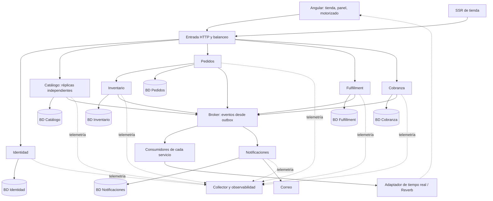

# 03 · Arquitectura del sistema: servicios independientes

| Campo | Valor |
|---|---|
| Proyecto | D'Too Limpieza |
| Versión | v2.0 · 30/09/2026 |
| Estado | Dirección de servicios independientes confirmada; diseño detallado propuesto, sin implementación validada |
| Decisión vigente | [ADR-013](adr/ADR-013-servicios-independientes.md) |
| Antecedente | [Arquitectura anterior archivada](historico/03-arquitectura-antes-servicios-2026-09-30.md) |

## 1. Introducción y objetivos

Plataforma de venta de productos de limpieza con pago contraentrega. Se requiere integridad de stock/dinero, continuidad operativa y servicios que puedan desplegarse, observarse y escalarse por separado. Cristhian Rodriguez Ruiz desarrolla, prueba y decide, con 20 h semanales.

El repositorio todavía contiene código inicial de un backend modular y un Compose para ese diseño. Este documento describe el destino, no un sistema ya ejecutable. El requisito de independencia reemplaza el despliegue único del ADR-005.

## 2. Restricciones

Angular, Laravel API, MySQL y monorepo se mantienen. Separar servicios no obliga a separar repositorios ni a cambiar de lenguaje. Los límites de dominio del 02 siguen siendo referencia, pero sus transacciones compartidas y las tablas del 04 deben adaptarse antes de implementar flujos distribuidos. Los requisitos de privacidad, accesibilidad y operación del 09 siguen abiertos.

## 3. Contexto y alcance

Clientes usan la tienda; administrador/almacén usan el panel; motorizados usan la aplicación con operación offline. El sistema integra correo, mapas y CI. Proveedores, presupuesto y producción quedan pendientes en ADR-009/010/011; analítica permanece reservada para ADR-012.

El primer trimestre propuesto valida dos servicios y su infraestructura mínima. La venta, entrega, cobro y sincronización offline completa se planifican después; ver [08](08-roadmap-y-plan-scrum.md).

## 4. Estrategia de solución

| Necesidad | Diseño objetivo | Evidencia exigida |
|---|---|---|
| Desplegar por servicio | Imágenes, configuración, migraciones y pipelines propios | Publicar/retroceder Catálogo sin publicar Identidad |
| Evitar propagación de saturación | Límites por servicio, timeout, concurrencia acotada, control de admisión y colas | Carga y fallos controlados con métricas por servicio |
| Aumentar capacidad | Réplicas HTTP/consumidores sin estado exclusivo del proceso | Dos réplicas de Catálogo y balanceo comprobado |
| Proteger datos | Base/usuario por servicio, sin consultas SQL cruzadas | Prueba de denegación con credencial ajena |
| Seguir una operación | OpenTelemetry y contexto propagado por HTTP/eventos | Traza con spans y logs correlacionados |
| Mantener consistencia | Transacción local + outbox/inbox; sagas para varios servicios | Reentrega, compensación y recuperación ensayadas |

## 5. Vista de bloques

### 5.1 Contenedores objetivo


```mermaid
flowchart TB
  UI[Angular: tienda, panel, motorizado] --> GW[Entrada HTTP y balanceo]
  SSR[SSR de tienda] --> GW
  GW --> ID[Identidad]
  GW --> CAT[Catálogo: réplicas independientes]
  GW --> PED[Pedidos]
  GW --> FUL[Fulfillment]
  GW --> COB[Cobranza]
  PED --> INV[Inventario]
  ID --> DBI[(BD Identidad)]
  CAT --> DBC[(BD Catálogo)]
  PED --> DBP[(BD Pedidos)]
  INV --> DBV[(BD Inventario)]
  FUL --> DBF[(BD Fulfillment)]
  COB --> DBO[(BD Cobranza)]
  CAT & PED & INV & FUL & COB --> MQ[Broker: eventos desde outbox]
  MQ --> CONS[Consumidores de cada servicio]
  MQ --> NOT[Notificaciones]
  NOT --> DBN[(BD Notificaciones)]
  NOT --> MAIL[Correo]
  CONS --> RT[Adaptador de tiempo real / Reverb]
  RT -.-> UI
  ID & CAT & PED & INV & FUL & COB & NOT -. telemetría .-> OTEL[Collector y observabilidad]
```

Es un esquema de responsabilidades, no un manifiesto de despliegue. Las llamadas autenticadas entre servicios y las dependencias de cada consumidor se especifican en sus contratos. El gateway enruta y aplica controles generales; no concentra reglas de negocio ni sustituye la autorización en cada servicio.

### 5.2 Servicios y datos

La tabla del [ADR-013](adr/ADR-013-servicios-independientes.md) propone siete servicios: Identidad, Catálogo, Inventario, Pedidos, Fulfillment, Cobranza y Notificaciones. Clientes, Zonas y Riesgo serían módulos de Pedidos inicialmente; la agrupación se revisa antes de checkout. Cada servicio conserva arquitectura interna por dominio/aplicación/infraestructura.

Estructura propuesta, aún no creada:

```text
services/{identidad,catalogo,...}/   proyectos Laravel y lockfiles propios
contracts/{identidad,catalogo,...}/ OpenAPI y eventos versionados
frontend/                          Angular y clientes generados
infra/                             Compose por perfiles y despliegue
```

El código en `backend/` no se borra ni se copia ciegamente. Se integra por capacidades, corrigiendo los hallazgos de la auditoría. Solo utilidades sin datos/modelos de negocio podrán compartirse mediante paquetes versionados; ningún paquete compartido exige publicar todos los servicios juntos.

### 5.3 Frontend

Se conserva el destino de tres aplicaciones Angular. La primera entrega usa un panel mínimo para login/MFA y una operación de catálogo; no compromete las tres apps completas ni el design system entero. El navegador utiliza la entrada pública y clientes generados por contrato; las APIs internas y bases no se exponen a Internet.

## 6. Vista de ejecución

### 6.1 Creación de pedido: flujo distribuido posterior

Pedidos persiste un intento; Inventario reserva stock mediante una operación idempotente; Pedidos asegura cupo y coordina la confirmación. Una respuesta perdida se reconcilia con la misma clave, sin asumir fracaso. Si no se puede finalizar, se compensan reservas/cupos y se conserva el estado pendiente hasta confirmar la liberación.

No existe un `BEGIN/COMMIT` que abarque las bases de Pedidos e Inventario. El [ADR-013](adr/ADR-013-servicios-independientes.md) define las garantías; 02/04/05 y OpenAPI deben acordar estados pendientes, vencimiento y UX antes de programar checkout. No se presenta éxito comercial mientras una reserva sea incierta.

### 6.2 Eventos y notificaciones

Cambio local y evento se guardan juntos. Outbox publica con confirmación; cada suscriptor tiene cola propia, inbox y reintentos limitados. Riesgo, disponibilidad, correos y tiempo real consumen hechos sin bloquear la respuesta HTTP original cuando su consistencia lo permite. Mensajes fallidos quedan recuperables con alarma y replay autorizado.

### 6.3 Entrega y cobro

Fulfillment conserva la operación idempotente del motorizado y publica la entrega. Cobranza registra el cobro en su transacción local; Pedidos actualiza su proyección con eventos. La interfaz distingue operación recibida, pendiente de sincronización y confirmada. Los conflictos offline y duplicados siguen pendientes de implementación y validación con el 02/05/ADR-008.

### 6.4 Primer recorrido técnico

Usuario de prueba inicia sesión con MFA; una operación protegida mínima de Catálogo valida su identidad mediante el mecanismo acordado, guarda el cambio y el outbox; un consumidor técnico procesa el evento en su propio almacén. Se sigue la traza completa y se reentrega el mensaje sin duplicar el efecto local. Ese consumidor no equivale a Notificaciones comercial terminado.

## 7. Vista de despliegue

Local: Docker Compose por perfiles, dos servicios iniciales, entrada HTTP, bases separadas, broker y telemetría. Los servicios posteriores no se crean como contenedores vacíos para aparentar cobertura. Una instancia MySQL local puede alojar bases con permisos separados; los recursos físicos continúan compartidos.

Producción: pendiente de ADR-009, costos y pruebas. Las APIs tendrán imágenes desplegables por separado, health/readiness checks, límites de recursos, réplicas configurables y migraciones compatibles hacia atrás. El rollback de código no revierte automáticamente datos; usar cambios de esquema aditivos y retirar campos solo tras comprobar compatibilidad.

Sesiones/caché deben poder compartirse entre réplicas del mismo servicio. Archivos persistentes requieren almacenamiento común accesible desde cualquier réplica, por ejemplo un servicio compatible S3. MySQL, broker, gateway y almacenamiento requieren su propio plan de capacidad, respaldo y recuperación. Un único host sigue siendo un punto de fallo aunque ejecute siete servicios.

No se garantiza capacidad de 300 o 3 000 pedidos/día por elegir un VPS concreto. Se registrarán mezcla de tráfico, concurrencia, datos, tiempos y recursos antes de dimensionar. Tampoco se promete que crecer no requerirá cambios de código.

## 8. Conceptos transversales

### 8.1 Seguridad

MFA del administrador, permisos de negocio aplicados en cada servicio, autenticación de comunicaciones internas y secretos separados. Definir contrato de identidad, revocación y fallo cerrado antes de implementar acceso protegido. No compartir tablas de tokens ni aceptar roles de cabeceras no verificadas. Limitar login, consultas y escrituras por actor y ruta.

### 8.2 Privacidad

Cada servicio recibe solo datos necesarios; evitar propagar direcciones/teléfonos en eventos de infraestructura. Retención, exportación y eliminación deben coordinarse entre propietarios de datos. Los plazos del 09 requieren cierre; la separación añade copias que deben inventariarse.

### 8.3 Errores

Contrato de error estable, sin detalles internos; identificador de traza para soporte. Distinguir validación, conflicto, exceso de cuota y dependencia temporalmente indisponible. Cada llamada tiene timeout y política de reintento explícita.

### 8.4 Idempotencia

Clave acotada por servicio, actor y operación, con hash de petición, estado persistido y replay. Probar concurrencia y caída tras commit. Un timeout no autoriza a generar otra clave. Inbox único por consumidor/evento y efecto local atómico; no prometer exactamente una vez para efectos externos.

### 8.5 Observabilidad

OpenTelemetry propuesto para trazas, con `traceparent` por HTTP y contexto en eventos; logs JSON con servicio, versión, entorno y trace/span IDs. Métricas de latencia p95/p99, errores, tráfico, saturación, base de datos, cola/outbox, reintentos y fallos. Correlation ID de negocio para reintentos largos, separado de la auditoría y de etiquetas de métricas. No registrar secretos ni datos personales. Herramientas y retención en ADR-010.

### 8.6 Rendimiento

Medir por servicio antes de agregar réplicas. Catálogo admite caché y proyecciones de disponibilidad; el checkout revalida en Inventario. Limitar fan-out y evitar cadenas HTTP largas. La autenticación no debe ejecutarse en cada lectura pública. Colas y pools SQL tienen capacidad finita; aplicar contrapresión y controlar admisión.

### 8.7 Formatos

Contratos versionados; dinero exacto con moneda; UTC persistido y America/Lima en pantalla; es-PE. Se conservan los value objects útiles tras probar compatibilidad.

### 8.8 Pruebas

Pruebas por servicio: dominio, persistencia real, contratos, autorización, aislamiento SQL, reintentos e idempotencia. Integración: trazas HTTP/asíncronas, reinicio del broker, mensajes duplicados/tardíos, saturación de un servicio, dos réplicas y despliegue/rollback independiente. El perfil de carga y sus umbrales se fijan antes de medir. Las pruebas del checkout y offline se añaden al implementar esos flujos; no se consideran aprobadas en fundaciones.

## 9. Decisiones y documentación pendiente

ADR-013 reemplaza la dirección anterior. ADR-009/010/011/012, revisión individual, contrato de identidad y broker quedan por concretar. Documentos 02/04/05/06/07 conservan material del diseño anterior: sus partes afectadas se adaptan por incremento. Las condiciones del ADR-013 prevalecen ante transacciones o despliegues únicos descritos allí.

## 10. Aceptación

Los siete criterios verificables del ADR-013 gobiernan el primer incremento; el [08](08-roadmap-y-plan-scrum.md) los distribuye por tareas y horas. No marcar «implementado» por disponer de un diagrama, carpetas o un contenedor que solo responde salud.

## 11. Riesgos y límites

La complejidad operativa, los fallos parciales y la consistencia eventual aumentan. El trimestre se limita a una base distribuida mínima; los siete servicios funcionales y el lanzamiento comercial quedan sin fecha. La capacidad de 20 h/semana se mantiene. La infraestructura local compartida permite probar límites y reintentos, pero no acredita tolerancia a la caída de un host ni un SLA productivo.
