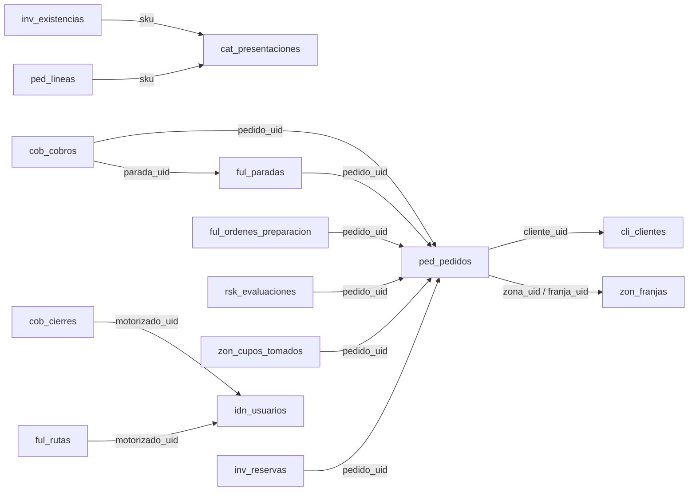

# 04 · Modelo de datos (MySQL 8)

| Campo | Valor |
|---|---|
| Proyecto | D'Too Limpieza |
| Estado | **v1.0 — CERRADO. Aprobado por el dueño del producto el 2026-09-14** |
| Fecha | 2026-09-14 |
| Depende de | 02 (agregados e invariantes) · ADR-003 (convenciones MySQL) · ADR-005 (prefijos por módulo) |

> Cada tabla pertenece a un módulo y lleva su prefijo. **No hay claves foráneas entre módulos**: las referencias cruzadas guardan el identificador público (ULID) del otro módulo y la integridad la garantiza el dueño. Dentro de un módulo sí hay FK.

## Convenciones (ADR-003)

| Aspecto | Regla |
|---|---|
| Clave primaria | `id BIGINT UNSIGNED AUTO_INCREMENT` (interna, nunca se expone) |
| Identificador público | `uid CHAR(26) NOT NULL UNIQUE` (ULID) — es lo que viaja en la API y en eventos |
| Dinero | `DECIMAL(12,2)`; la moneda es `PEN` en toda la fase 1 y se guarda como columna solo en `ped_pedidos` y `cob_cobros` para preparar el futuro |
| Fechas | `DATETIME(3)` en UTC; `creado_en`, `actualizado_en` en toda tabla mutable |
| Estados | `VARCHAR(32)`; valores validados en el dominio (no `ENUM`) |
| Borrado | Nunca físico en datos de negocio; `eliminado_en` solo donde se indica |
| Texto | `utf8mb4`; nombres ≤ 150, notas `TEXT` |
| Geo | `POINT SRID 4326` / `POLYGON SRID 4326` con `SPATIAL INDEX` |
| Prefijos | `cat_` Catalogo · `inv_` Inventario · `zon_` Zonas · `cli_` Clientes · `ped_` Pedidos · `rsk_` Riesgo · `ful_` Fulfillment · `cob_` Cobranza · `idn_` Identidad · `not_` Notificaciones · `sys_` compartido |

Las columnas `id`, `uid`, `creado_en`, `actualizado_en` se omiten abajo por brevedad salvo que tengan algo especial.

---

## 1. Catalogo (`cat_`)

### cat_categorias
| Columna | Tipo | Notas |
|---|---|---|
| padre_id | BIGINT UNSIGNED NULL FK→cat_categorias | Árbol ≤ 3 niveles |
| nombre | VARCHAR(100) | |
| slug | VARCHAR(120) UNIQUE | Para URL `/c/:slug` |
| orden | SMALLINT | Orden de presentación |
| activa | BOOLEAN | |
| meta_titulo, meta_descripcion | VARCHAR(160) NULL | SEO |

### cat_productos
| Columna | Tipo | Notas |
|---|---|---|
| categoria_id | BIGINT UNSIGNED FK→cat_categorias | |
| nombre | VARCHAR(150) | |
| slug | VARCHAR(170) UNIQUE | `/p/:slug` |
| marca | VARCHAR(80) NULL | |
| descripcion | TEXT NULL | |
| atributos | JSON NULL | Fragancia, uso, advertencias; no se filtra por SQL |
| estado | VARCHAR(32) | `borrador` / `publicado` / `retirado` |
| eliminado_en | DATETIME(3) NULL | |

Índices: `(categoria_id, estado)`, `FULLTEXT(nombre, marca, descripcion)` para búsqueda simple en fase 1.

### cat_presentaciones
| Columna | Tipo | Notas |
|---|---|---|
| producto_id | BIGINT UNSIGNED FK→cat_productos | |
| sku | VARCHAR(40) UNIQUE | Único en todo el catálogo |
| nombre | VARCHAR(80) | "1 L", "Galón 4 L", "Pack ×6" |
| unidad_medida | VARCHAR(20) | `ml`, `l`, `g`, `kg`, `unidad` |
| contenido | DECIMAL(10,3) NULL | 1.000 para "1 L" |
| unidades_por_pack | SMALLINT | 1 salvo packs |
| codigo_barras | VARCHAR(20) NULL | |
| peso_gramos | INT NULL | Para planificar carga de moto |
| orden | SMALLINT | |
| estado | VARCHAR(32) | `publicada` / `retirada` |

### cat_listas_precios
| Columna | Tipo | Notas |
|---|---|---|
| codigo | VARCHAR(20) UNIQUE | `HOGAR`, `NEGOCIO` |
| nombre | VARCHAR(80) | |
| activa | BOOLEAN | |

### cat_precios
| Columna | Tipo | Notas |
|---|---|---|
| presentacion_id | BIGINT UNSIGNED FK→cat_presentaciones | |
| lista_id | BIGINT UNSIGNED FK→cat_listas_precios | |
| precio | DECIMAL(12,2) | **Precio final al público, IGV incluido** (confirmado) |
| vigente_desde | DATETIME(3) | |
| vigente_hasta | DATETIME(3) NULL | NULL = vigente |
| creado_por_uid | CHAR(26) | Usuario interno (Identidad), sin FK |

Índices: `(presentacion_id, lista_id, vigente_desde)`. Precio vigente = fila con `vigente_hasta IS NULL`. Nunca se edita un precio: se cierra y se inserta otro (historial completo).

### cat_imagenes
| Columna | Tipo | Notas |
|---|---|---|
| producto_id | BIGINT UNSIGNED FK→cat_productos | |
| ruta | VARCHAR(255) | Clave en el almacén de objetos |
| alt | VARCHAR(150) | Accesibilidad |
| orden | SMALLINT | |

---

## 2. Inventario (`inv_`)

### inv_almacenes
| Columna | Tipo | Notas |
|---|---|---|
| codigo | VARCHAR(20) UNIQUE | `PRINCIPAL` en fase 1 |
| nombre | VARCHAR(80) | |
| activo | BOOLEAN | |

### inv_existencias
| Columna | Tipo | Notas |
|---|---|---|
| almacen_id | BIGINT UNSIGNED FK→inv_almacenes | |
| sku | VARCHAR(40) | Referencia a Catalogo por SKU, sin FK |
| existencia | INT NOT NULL DEFAULT 0 | Físico |
| reservado | INT NOT NULL DEFAULT 0 | Comprometido |
| umbral_pocas_unidades | SMALLINT DEFAULT 5 | Para el badge en tienda |
| version | INT NOT NULL DEFAULT 0 | Bloqueo optimista adicional |

`UNIQUE(almacen_id, sku)`. **`disponible` no se guarda:** se calcula `existencia − reservado`. `CHECK (reservado <= existencia AND reservado >= 0)`.

### inv_reservas
| Columna | Tipo | Notas |
|---|---|---|
| existencia_id | BIGINT UNSIGNED FK→inv_existencias | |
| pedido_uid | CHAR(26) | Sin FK (otro módulo) |
| cantidad | INT | |
| estado | VARCHAR(32) | `activa` / `consumida` / `liberada` / `expirada` |
| expira_en | DATETIME(3) NULL | 30 min para clientes nuevos sin correo verificado; NULL si no expira |
| resuelta_en | DATETIME(3) NULL | |

Índices: `(pedido_uid)`, `(estado, expira_en)` para el scheduler.

### inv_movimientos
| Columna | Tipo | Notas |
|---|---|---|
| existencia_id | BIGINT UNSIGNED FK→inv_existencias | |
| tipo | VARCHAR(32) | `entrada` / `salida_venta` / `ajuste` / `reingreso_devolucion` / `merma` |
| cantidad | INT | Positivo o negativo |
| existencia_resultante | INT | Saldo tras el movimiento (auditoría) |
| referencia_uid | CHAR(26) NULL | Pedido, orden de compra, etc. |
| motivo | VARCHAR(255) NULL | |
| usuario_uid | CHAR(26) NULL | NULL si lo hizo el sistema |

**Inmutable**: sin `actualizado_en`, sin UPDATE. Índice `(existencia_id, creado_en)`.

---

## 3. Zonas (`zon_`)

### zon_zonas
| Columna | Tipo | Notas |
|---|---|---|
| codigo | VARCHAR(20) UNIQUE | `CDLR` |
| nombre | VARCHAR(80) | Carmen de la Legua-Reynoso |
| poligono | POLYGON SRID 4326 NOT NULL | `SPATIAL INDEX` |
| costo_envio | DECIMAL(12,2) DEFAULT 0 | Configurable; 0 en fase 1 |
| monto_minimo | DECIMAL(12,2) DEFAULT 0 | Configurable; 0 en fase 1 |
| activa | BOOLEAN | |

### zon_franjas
| Columna | Tipo | Notas |
|---|---|---|
| zona_id | BIGINT UNSIGNED FK→zon_zonas | |
| dia_semana | TINYINT | 1 = lunes … 7 = domingo |
| hora_inicio, hora_fin | TIME | Dentro de 07:00–21:00 |
| cupo_por_defecto | SMALLINT | |
| hora_corte_mismo_dia | TIME NULL | Hasta qué hora se acepta para esta franja el mismo día |
| activa | BOOLEAN | |

### zon_cupos
| Columna | Tipo | Notas |
|---|---|---|
| franja_id | BIGINT UNSIGNED FK→zon_franjas | |
| fecha | DATE | |
| maximo | SMALLINT | Ajustable el mismo día según motorizados activos |
| ocupados | SMALLINT DEFAULT 0 | |

`UNIQUE(franja_id, fecha)`. Tomar cupo: `UPDATE zon_cupos SET ocupados = ocupados + 1 WHERE id = ? AND ocupados < maximo` → 0 filas = agotado. `CHECK (ocupados <= maximo)`.

### zon_cupos_tomados
| Columna | Tipo | Notas |
|---|---|---|
| cupo_id | BIGINT UNSIGNED FK→zon_cupos | |
| pedido_uid | CHAR(26) UNIQUE | Un pedido ocupa un solo cupo |
| estado | VARCHAR(32) | `tomado` / `devuelto` |

---

## 4. Clientes (`cli_`)

### cli_clientes
| Columna | Tipo | Notas |
|---|---|---|
| telefono | VARCHAR(20) UNIQUE | E.164 (`+519…`). **Identificador del cliente** |
| nombre | VARCHAR(150) | |
| correo | VARCHAR(190) NULL | Opcional |
| correo_verificado_en | DATETIME(3) NULL | |
| segmento | VARCHAR(20) | `hogar` / `negocio` |
| tipo | VARCHAR(20) | `invitado` / `registrado` |
| password_hash | VARCHAR(255) NULL | Solo registrados (Argon2id) |
| razon_social | VARCHAR(150) NULL | Negocios, opcional |
| anonimizado_en | DATETIME(3) NULL | Ley 29733 |
| ultima_entrega_en | DATETIME(3) NULL | Para retención |

Índices: `(segmento)`, `(tipo, ultima_entrega_en)` para anonimización.

### cli_direcciones
| Columna | Tipo | Notas |
|---|---|---|
| cliente_id | BIGINT UNSIGNED FK→cli_clientes | |
| etiqueta | VARCHAR(40) | "Casa", "Bodega" |
| direccion | VARCHAR(255) | |
| referencia | VARCHAR(255) NOT NULL | Obligatoria |
| ubicacion | POINT SRID 4326 NOT NULL | `SPATIAL INDEX` |
| zona_uid | CHAR(26) | Zona resuelta al guardar; sin FK |
| predeterminada | BOOLEAN | |
| eliminado_en | DATETIME(3) NULL | |

### cli_consentimientos
| Columna | Tipo | Notas |
|---|---|---|
| cliente_id | BIGINT UNSIGNED FK→cli_clientes | |
| finalidad | VARCHAR(40) | `marketing` / `terminos` |
| version_texto | VARCHAR(20) | |
| otorgado | BOOLEAN | |
| canal | VARCHAR(20) | `web` / `panel` |
| ip_hash | CHAR(64) NULL | Prueba sin guardar la IP |

**Inmutable**; el consentimiento vigente es la última fila por finalidad.

### cli_verificaciones_correo
| Columna | Tipo | Notas |
|---|---|---|
| cliente_id | BIGINT UNSIGNED FK→cli_clientes | |
| token_hash | CHAR(64) | |
| expira_en | DATETIME(3) | |
| usado_en | DATETIME(3) NULL | |

---

## 5. Pedidos (`ped_`)

### ped_pedidos
| Columna | Tipo | Notas |
|---|---|---|
| numero | VARCHAR(12) UNIQUE | Legible: `DT-000123`. Con teléfono permite consulta pública |
| cliente_uid | CHAR(26) | Sin FK |
| cliente_telefono | VARCHAR(20) | **Copia** para consulta pública y auditoría |
| cliente_nombre | VARCHAR(150) | Copia |
| cliente_correo | VARCHAR(190) NULL | Copia |
| segmento | VARCHAR(20) | Copia |
| lista_precios_codigo | VARCHAR(20) | `HOGAR` / `NEGOCIO` |
| direccion, referencia | VARCHAR(255) | Copia |
| ubicacion | POINT SRID 4326 | Copia |
| zona_uid | CHAR(26) | |
| fecha_entrega | DATE | |
| franja_uid | CHAR(26) | |
| franja_texto | VARCHAR(40) | Copia: "9:00–12:00" |
| subtotal, igv, total | DECIMAL(12,2) | `total` = a cobrar en puerta |
| costo_envio | DECIMAL(12,2) DEFAULT 0 | |
| moneda | CHAR(3) DEFAULT 'PEN' | |
| metodo_pago_declarado | VARCHAR(20) NOT NULL | **Obligatorio en el checkout:** `efectivo` / `yape` / `plin` / `tarjeta` (débito o crédito en el POS del motorizado) |
| paga_con | DECIMAL(12,2) NULL | **Obligatorio si `metodo_pago_declarado = efectivo`**; `CHECK (paga_con >= total)`. El vuelto = `paga_con − total` se muestra al motorizado y se suma por ruta para saber cuánto efectivo llevar |
| nota_cliente | VARCHAR(500) NULL | |
| estado | VARCHAR(32) | Máquina de estados 02 §4.5 |
| intentos_entrega | TINYINT DEFAULT 0 | Máx. 1 reintento |
| canal | VARCHAR(20) | `tienda` / `panel` (pedido tomado por teléfono) |
| creado_por_uid | CHAR(26) NULL | Usuario interno si `canal = panel` |
| confirmado_en, entregado_en, cobrado_en, cancelado_en | DATETIME(3) NULL | Atajos para reportes |
| anonimizado_en | DATETIME(3) NULL | |

Índices: `(estado, fecha_entrega)`, `(cliente_uid, creado_en)`, `(numero, cliente_telefono)` para consulta pública, `(fecha_entrega, franja_uid, estado)` para Fulfillment.

### ped_lineas
| Columna | Tipo | Notas |
|---|---|---|
| pedido_id | BIGINT UNSIGNED FK→ped_pedidos | |
| sku | VARCHAR(40) | |
| producto_nombre, presentacion_nombre | VARCHAR(150) / VARCHAR(80) | Copias |
| cantidad | INT | |
| precio_unitario | DECIMAL(12,2) | Con IGV, copia del precio vigente |
| igv_unitario | DECIMAL(12,4) | |
| subtotal_linea | DECIMAL(12,2) | |
| peso_gramos | INT NULL | Copia |

`UNIQUE(pedido_id, sku)`.

### ped_transiciones
| Columna | Tipo | Notas |
|---|---|---|
| pedido_id | BIGINT UNSIGNED FK→ped_pedidos | |
| de_estado, a_estado | VARCHAR(32) | |
| motivo | VARCHAR(255) NULL | |
| actor_tipo | VARCHAR(20) | `sistema` / `cliente` / `usuario` |
| actor_uid | CHAR(26) NULL | |
| evento_uid | CHAR(26) NULL | Evento que la provocó |

**Inmutable.** Índice `(pedido_id, creado_en)`. Es la fuente del historial que ve el administrador.

---

## 6. Riesgo (`rsk_`)

### rsk_reglas
| Columna | Tipo | Notas |
|---|---|---|
| codigo | VARCHAR(40) UNIQUE | `sin_historial`, `sin_correo_verificado`, `monto_alto_primer_pedido`, `en_lista_observacion`, `repeticion_direccion_24h`, `cliente_fiel` |
| descripcion | VARCHAR(255) | |
| parametros | JSON NULL | `{"monto": 150}` |
| peso | SMALLINT | Puede ser negativo |
| activa | BOOLEAN | |

### rsk_evaluaciones
| Columna | Tipo | Notas |
|---|---|---|
| pedido_uid | CHAR(26) UNIQUE | |
| senales | JSON | `[{"codigo":"sin_historial","peso":2}, …]` |
| puntaje | SMALLINT | |
| umbral_aplicado | SMALLINT | |
| modo_global_manual | BOOLEAN | Si estaba activo `confirmacion_manual_para_todos` |
| decision | VARCHAR(32) | `auto_confirmado` / `en_revision` |
| resolucion | VARCHAR(32) NULL | `aprobado` / `rechazado` / `vencido` |
| resuelto_por_uid | CHAR(26) NULL | |
| resuelto_en | DATETIME(3) NULL | |
| nota | VARCHAR(500) NULL | |
| vence_en | DATETIME(3) NULL | 2 h de horario operativo |

Índice `(decision, resolucion, vence_en)` para el scheduler.

### rsk_lista_observacion
| Columna | Tipo | Notas |
|---|---|---|
| tipo | VARCHAR(20) | `telefono` / `correo` / `ubicacion` |
| valor_hash | CHAR(64) | Hash del valor normalizado (no se guarda en claro) |
| ubicacion | POINT SRID 4326 NULL | Para tipo `ubicacion`, radio 30 m |
| motivo | VARCHAR(255) | |
| origen_pedido_uid | CHAR(26) NULL | |
| activo | BOOLEAN | |
| expira_en | DATETIME(3) NULL | |

`UNIQUE(tipo, valor_hash)`.

---

## 7. Fulfillment (`ful_`)

### ful_ordenes_preparacion
| Columna | Tipo | Notas |
|---|---|---|
| pedido_uid | CHAR(26) UNIQUE | |
| estado | VARCHAR(32) | `pendiente` / `en_curso` / `terminada` / `con_faltante` |
| preparado_por_uid | CHAR(26) NULL | |
| iniciada_en, terminada_en | DATETIME(3) NULL | |
| hoja_impresa_en | DATETIME(3) NULL | Hoja de pedido |

### ful_faltantes
| Columna | Tipo | Notas |
|---|---|---|
| orden_id | BIGINT UNSIGNED FK→ful_ordenes_preparacion | |
| sku | VARCHAR(40) | |
| cantidad_faltante | INT | |
| resolucion | VARCHAR(32) NULL | `ajuste_inventario` / `linea_retirada` / `pedido_cancelado` |
| resuelto_por_uid | CHAR(26) NULL | |

### ful_rutas
| Columna | Tipo | Notas |
|---|---|---|
| fecha | DATE | |
| numero_salida | TINYINT | 1, 2, 3 |
| motorizado_uid | CHAR(26) | Usuario interno |
| estado | VARCHAR(32) | `planificada` / `en_curso` / `cerrada` |
| iniciada_en, cerrada_en | DATETIME(3) NULL | |
| capacidad_referencia | SMALLINT DEFAULT 30 | Solo aviso, no bloquea |
| creada_por_uid | CHAR(26) | |

Índice `(fecha, motorizado_uid)`.

### ful_paradas
| Columna | Tipo | Notas |
|---|---|---|
| ruta_id | BIGINT UNSIGNED FK→ful_rutas | |
| pedido_uid | CHAR(26) | |
| orden | SMALLINT | Secuencia en la ruta |
| vuelto_previsto | DECIMAL(12,2) NULL | Copia de `paga_con − total` si el pedido declaró efectivo; la ruta suma esta columna para indicar el efectivo que debe llevar el motorizado |
| resultado | VARCHAR(32) NULL | `entregado` / `rechazado` / `no_encontrado` / `cancelada` |
| motivo | VARCHAR(255) NULL | |
| metodo_cobro | VARCHAR(20) NULL | Lo que realmente ocurrió en puerta: `efectivo` / `yape` / `plin` / `tarjeta`. Puede diferir del declarado (el cliente cambió de idea); ambos quedan registrados |
| monto_recibido | DECIMAL(12,2) NULL | |
| referencia_operacion | VARCHAR(40) NULL | N.º Yape/Plin/POS |
| foto_ruta | VARCHAR(255) NULL | Opcional |
| registrado_en_dispositivo | DATETIME(3) NULL | Hora del celular |
| recibido_en_servidor | DATETIME(3) NULL | |
| ubicacion_registro | POINT SRID 4326 NULL | Dónde se marcó |
| operation_id | CHAR(26) NULL UNIQUE | Idempotencia desde la PWA |

`UNIQUE(ruta_id, pedido_uid)`. Índice `(pedido_uid)`. Un pedido activo en una sola ruta se garantiza en la aplicación consultando paradas sin resultado.

---

## 8. Cobranza (`cob_`)

### cob_cobros
| Columna | Tipo | Notas |
|---|---|---|
| pedido_uid | CHAR(26) | |
| parada_uid | CHAR(26) UNIQUE | Origen |
| motorizado_uid | CHAR(26) | |
| fecha_operativa | DATE | Día de caja |
| monto_esperado | DECIMAL(12,2) | Total del pedido |
| monto_recibido | DECIMAL(12,2) | |
| metodo | VARCHAR(20) | `efectivo` / `yape` / `plin` / `tarjeta` |
| referencia_operacion | VARCHAR(40) NULL | |
| moneda | CHAR(3) DEFAULT 'PEN' | |

**Inmutable** (sin `actualizado_en`). Índices `(motorizado_uid, fecha_operativa)`, `(pedido_uid)`.

### cob_ajustes
| Columna | Tipo | Notas |
|---|---|---|
| cobro_id | BIGINT UNSIGNED FK→cob_cobros | |
| monto | DECIMAL(12,2) | Positivo o negativo |
| motivo | VARCHAR(500) NOT NULL | |
| autorizado_por_uid | CHAR(26) | Administrador |
| cierre_id | BIGINT UNSIGNED NULL FK→cob_cierres | Si nació en un cierre |

**Inmutable.**

### cob_cierres
| Columna | Tipo | Notas |
|---|---|---|
| motorizado_uid | CHAR(26) | |
| fecha_operativa | DATE | |
| esperado_efectivo, esperado_yape, esperado_plin, esperado_tarjeta | DECIMAL(12,2) | Calculados desde cobros |
| declarado_efectivo, declarado_yape, declarado_plin, declarado_tarjeta | DECIMAL(12,2) NULL | Lo que entrega o acredita el motorizado |
| diferencia | DECIMAL(12,2) NULL | Declarado − esperado (total) |
| justificacion | VARCHAR(500) NULL | Obligatoria si diferencia ≠ 0 |
| estado | VARCHAR(32) | `abierto` / `declarado` / `cerrado` |
| cerrado_por_uid | CHAR(26) NULL | |
| cerrado_en | DATETIME(3) NULL | |

`UNIQUE(motorizado_uid, fecha_operativa)`. Un cierre `abierto` de fecha anterior genera aviso, nunca bloqueo.

---

## 9. Identidad (`idn_`)

### idn_usuarios
| Columna | Tipo | Notas |
|---|---|---|
| nombre | VARCHAR(150) | |
| usuario | VARCHAR(40) UNIQUE | **Login: usuario y contraseña** (confirmado). Minúsculas, sin espacios |
| correo | VARCHAR(190) NULL | Solo para recuperación de contraseña y avisos; opcional |
| telefono | VARCHAR(20) NULL | |
| password_hash | VARCHAR(255) | Argon2id |
| rol | VARCHAR(20) | `administrador` / `almacen` / `motorizado` |
| mfa_secreto_cifrado | VARBINARY(255) NULL | Obligatorio para administrador |
| activo | BOOLEAN | |
| ultimo_acceso_en | DATETIME(3) NULL | |

Tokens: tabla estándar de Sanctum (`personal_access_tokens`).

---

## 10. Notificaciones (`not_`)

### not_plantillas
| Columna | Tipo | Notas |
|---|---|---|
| codigo | VARCHAR(40) UNIQUE | `pedido_creado`, `pedido_confirmado`, `pedido_en_ruta`, `pedido_entregado`, `entrega_fallida`, `verificar_correo` |
| canal | VARCHAR(20) | `correo` / `panel` |
| asunto | VARCHAR(150) NULL | |
| cuerpo | TEXT | Con marcadores `{{numero}}` |
| activa | BOOLEAN | |

### not_envios
| Columna | Tipo | Notas |
|---|---|---|
| plantilla_codigo | VARCHAR(40) | |
| destinatario_tipo | VARCHAR(20) | `cliente` / `usuario` |
| destinatario_uid | CHAR(26) | Nunca el correo en claro |
| referencia_uid | CHAR(26) NULL | Pedido |
| estado | VARCHAR(20) | `pendiente` / `enviado` / `fallido` / `omitido_sin_correo` |
| error | VARCHAR(255) NULL | |
| enviado_en | DATETIME(3) NULL | |

### not_avisos_panel
| Columna | Tipo | Notas |
|---|---|---|
| tipo | VARCHAR(40) | `pedido_en_revision`, `cupo_agotado`, `diferencia_caja`, `cierre_pendiente`, `faltante`, `revision_por_vencer`, `stock_agotado` |
| severidad | VARCHAR(10) | `info` / `alerta` / `critico` |
| referencia_uid | CHAR(26) NULL | |
| mensaje | VARCHAR(255) | |
| leido_por_uid | CHAR(26) NULL | |
| leido_en | DATETIME(3) NULL | |
| resuelto_en | DATETIME(3) NULL | |

---

## 11. Compartido (`sys_`)

### sys_outbox
| Columna | Tipo | Notas |
|---|---|---|
| event_uid | CHAR(26) UNIQUE | |
| nombre | VARCHAR(60) | `PedidoCreado` |
| version | TINYINT | |
| agregado_tipo, agregado_uid | VARCHAR(40), CHAR(26) | |
| payload | JSON | Según `contracts/events/` |
| ocurrido_en | DATETIME(3) | |
| despachado_en | DATETIME(3) NULL | |
| intentos | TINYINT DEFAULT 0 | |
| error | VARCHAR(255) NULL | |

Índice `(despachado_en, id)`. Trabajador: `SELECT … WHERE despachado_en IS NULL ORDER BY id LIMIT 100 FOR UPDATE SKIP LOCKED`. Filas despachadas > 30 días se archivan/eliminan por el scheduler (partición por mes si crece).

### sys_eventos_procesados
| Columna | Tipo | Notas |
|---|---|---|
| consumidor | VARCHAR(60) | `Riesgo.EvaluarPedido` |
| event_uid | CHAR(26) | |
| procesado_en | DATETIME(3) | |

`PRIMARY KEY(consumidor, event_uid)` → idempotencia de consumidores.

### sys_idempotencia
| Columna | Tipo | Notas |
|---|---|---|
| clave | VARCHAR(80) | `Idempotency-Key` |
| actor_uid | CHAR(26) | Cliente o usuario |
| ruta | VARCHAR(120) | |
| cuerpo_hash | CHAR(64) | |
| status_respuesta | SMALLINT | |
| respuesta | JSON | |
| expira_en | DATETIME(3) | 24 h |

`PRIMARY KEY(clave, actor_uid)`.

### sys_auditoria
| Columna | Tipo | Notas |
|---|---|---|
| actor_tipo, actor_uid | VARCHAR(20), CHAR(26) NULL | |
| accion | VARCHAR(60) | `precio.cambiar`, `pedido.confirmar_manual`, `cobro.ajustar`, `configuracion.cambiar` |
| entidad_tipo, entidad_uid | VARCHAR(40), CHAR(26) | |
| antes, despues | JSON NULL | Sin datos personales en claro |
| ip_hash | CHAR(64) NULL | |
| trace_id | CHAR(32) NULL | |

**Inmutable.** Índices `(entidad_tipo, entidad_uid)`, `(actor_uid, creado_en)`.

### sys_configuracion
| Columna | Tipo | Notas |
|---|---|---|
| clave | VARCHAR(80) PRIMARY KEY | `riesgo.confirmacion_manual_para_todos`, `riesgo.umbral`, `inventario.expiracion_reserva_min`, `riesgo.plazo_revision_horas`, `fulfillment.max_reintentos`, `fulfillment.capacidad_moto_referencia`, `catalogo.umbral_pocas_unidades` |
| valor | JSON | |
| descripcion | VARCHAR(255) | |
| actualizado_por_uid | CHAR(26) NULL | |

Cada cambio se registra en `sys_auditoria`. Valores iniciales: manual para todos = `true`, umbral = 3, expiración = 30, plazo = 2, reintentos = 1, capacidad = 30, pocas unidades = 5.

---

## 12. Referencias cruzadas entre módulos (sin FK)

Cada flecha es un `CHAR(26)` indexado. Si el módulo destino se extrae a otro servicio, la columna no cambia.

## 13. Consultas críticas y su plan

| Operación | Consulta | Garantía |
|---|---|---|
| Reservar N líneas | Ordenar SKUs; por cada uno `SELECT … FROM inv_existencias WHERE almacen_id=? AND sku=? FOR UPDATE`; verificar `existencia − reservado ≥ n`; `UPDATE … SET reservado = reservado + n`; insertar reserva | Sin deadlocks (orden fijo), sin sobreventa (lock de fila) |
| Tomar cupo | `UPDATE zon_cupos SET ocupados = ocupados + 1 WHERE id=? AND ocupados < maximo` | Atómico; 0 filas = agotado |
| Zona de una coordenada | `SELECT uid FROM zon_zonas WHERE activa AND ST_Contains(poligono, ST_SRID(POINT(?,?),4326))` | Índice espacial |
| Consulta pública de pedido | `WHERE numero=? AND cliente_telefono=?` | Índice compuesto; rate limit |
| Cola de preparación | `WHERE estado='Confirmado' AND fecha_entrega=? ORDER BY franja, confirmado_en` | Índice `(estado, fecha_entrega)` |
| Expirar reservas | `WHERE estado='activa' AND expira_en < NOW(3)` en lotes de 100 | Índice `(estado, expira_en)` |
| Outbox | `FOR UPDATE SKIP LOCKED` | Varios workers sin bloquearse |
| Historial de un cliente para riesgo | Agregados sobre `ped_pedidos WHERE cliente_uid=?` (entregados, rechazados, monto promedio) | Índice `(cliente_uid, creado_en)`; cacheable 5 min |

## 14. Retención y anonimización (scheduler diario)

| Dato | Regla | Acción |
|---|---|---|
| Invitados con `ultima_entrega_en` > 12 meses | Ley 29733, 01 §6.5 | Reemplazar nombre/teléfono/correo/dirección por marcadores en `cli_*` y copias en `ped_pedidos`; conservar montos y estados |
| Registrados inactivos > 24 meses | Igual | Igual + desactivar cuenta |
| `sys_outbox` despachado > 30 días | Operativo | Eliminar |
| `sys_idempotencia` expirada | Operativo | Eliminar |
| `not_envios` > 6 meses | Operativo | Eliminar |
| `sys_auditoria`, `cob_*`, `ped_transiciones`, `inv_movimientos` | Nunca se eliminan | Solo anonimizar referencias personales |

## 15. Orden de migraciones

1. `sys_*` (compartido) → 2. `idn_` → 3. `cat_` → 4. `inv_` → 5. `zon_` → 6. `cli_` → 7. `ped_` → 8. `rsk_` → 9. `ful_` → 10. `cob_` → 11. `not_`.

Cada módulo tiene su carpeta `Database/Migrations`; el orden lo da el prefijo de fecha. Seeders: catálogo de ejemplo (20 SKU), zona CDLR con polígono real, franjas de lunes a domingo, reglas de riesgo iniciales, configuración inicial, usuario administrador.

## 16. Decisiones de negocio confirmadas

| Decisión | Valor | Efecto en el modelo |
|---|---|---|
| Precios | Final al público, IGV incluido | `cat_precios.precio` es lo que paga el cliente; el IGV se desglosa por línea solo para reportes |
| Método de pago en checkout | Obligatorio: efectivo, Yape, Plin o tarjeta (POS) | `ped_pedidos.metodo_pago_declarado NOT NULL` |
| Monto "pago con" | Obligatorio si efectivo | `ped_pedidos.paga_con`, vuelto calculado y sumado por ruta (`ful_paradas.vuelto_previsto`) |
| Login del personal | Usuario y contraseña | `idn_usuarios.usuario UNIQUE`; correo opcional |

> Nota de vocabulario: en el documento 02 el método "POS" pasa a llamarse **tarjeta** (débito o crédito cobrada con el POS del motorizado). El código usa `tarjeta`.

## 16b. Adenda (2026-09-14, derivada de 05 UX)

### not_avisos_stock
| Columna | Tipo | Notas |
|---|---|---|
| sku | VARCHAR(40) | |
| telefono | VARCHAR(20) | E.164 |
| correo | VARCHAR(190) NULL | |
| notificado_en | DATETIME(3) NULL | Se llena al reaccionar a `StockReingresado` |

`UNIQUE(sku, telefono)`. Se anonimiza junto con el cliente.

Regla derivada: `ful_paradas.monto_recibido` y `cob_cobros.monto_recibido` son siempre iguales al total del pedido (no hay cobros parciales); se conservan por auditoría y para fases futuras.

## 16c. Adenda (2026-09-25, derivada de 09 Cumplimiento)

- `cat_productos.afirmaciones` JSON NULL — lista de `{texto, fuente, referencia}`; el panel no publica afirmaciones sin fuente.
- `cat_productos.registro_sanitario` VARCHAR(60) NULL — cuando aplique.
- `cat_imagenes.origen` VARCHAR(20) NOT NULL (`propia` / `proveedor` / `licencia`) y `cat_imagenes.licencia_ref` VARCHAR(255) NULL.
- `cli_consentimientos.finalidad` admite además `avisame`, `lead_zona`, `cuenta`, `reclamacion`.
- Nueva tabla `rec_reclamaciones` (Libro de Reclamaciones): `numero` correlativo UNIQUE, tipo (`reclamo`/`queja`), datos del consumidor exigidos por la norma, `pedido_uid` NULL, detalle, pedido del consumidor, `respuesta`, `respondido_en`, `vence_en`, `estado`. Inmutable salvo respuesta. Retención según plazo legal.
- Nuevo tipo de pedido `reposicion` (`ped_pedidos.tipo` VARCHAR(20) DEFAULT `venta`) con `total` 0 y referencia al pedido original (`pedido_origen_uid`); `cob_ajustes.motivo` admite `reembolso`.
- Claves `negocio.*` en `sys_configuracion` (razón social, RUC, dirección, teléfono, correo, horario).

## 17. Historial de versiones

| Versión | Fecha | Cambio |
|---|---|---|
| 0.1 | 2026-09-14 | Borrador inicial, 38 tablas |
| 1.0 | 2026-09-14 | IGV incluido, método de pago obligatorio con "pago con", login por usuario; cerrado |
| 1.0.1 | 2026-09-14 | Adenda: tabla `not_avisos_stock` y regla de cobro total (sin reabrir el documento) |
| 1.0.2 | 2026-09-25 | Adenda 16c: cumplimiento (afirmaciones, licencias, reclamaciones, reposición, datos del negocio) |
